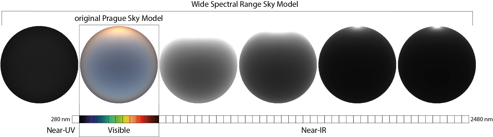
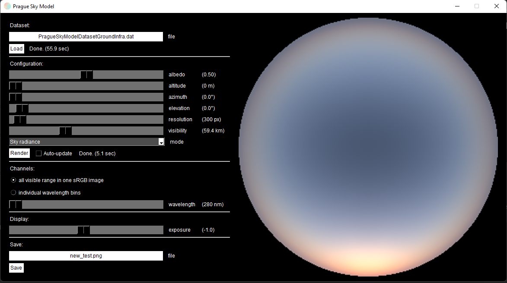

# Skylight Simulation  [](https://github.com/evgkanias/sky/blob/main/LICENSE)  



Python simulations of the skylight information based on the
[Vévoda et al. (2022)](https://cgg.mff.cuni.cz/publications/infrared-skymodel-2022/) Prague Sky Model.
This contains a Python implementation of the Prague Sky Model 2022 including a copy of their GUI (original C++ code
[here](https://cgg.mff.cuni.cz/wp-content/uploads/2022/09/vevoda_2022_infrared_sky_implementation.zip)).
There are three available datasets that work with this model, which can be downloaded form here:
* [Google Drive with the near-infrared (SWIR) dataset](https://drive.google.com/file/d/1ZOizQCN6tH39JEwyX8KvAj7WEdX-EqJl/view?usp=sharing)
  (omits data in different altitudes)
* [Google Drive with the full model](https://drive.google.com/drive/folders/19Iw0mB_UFTtbrFcojHmHc7mjc3PYe_AC?usp=sharing)
  (omits near infrared data)
* [Google Drive with the hemispherical model](https://drive.google.com/drive/folders/1R9dTbOhBXthY3y9BTI4H28acl9dJLIaV?usp=sharing)
  (omits polarisation data and different altitudes)

## Installation

In order to install the package and reproduce the results of the manuscript you need to clone
the code, navigate to the main directory of the project, install the dependencies and finally
the package itself. Here is an example code that installs the package:

1. Clone this repo.
```commandline
mkdir ~/src
cd ~/src
git clone https://github.com/evgkanias/sky.git
cd sky
```
2. Install the required libraries. 
   1. using pip :
      ```commandline
      pip install -r requirements.txt
      ```

   2. using conda :
      ```commandline
      conda env create -f environment.yml
      ```
3. Install the package.
   1. using pip :
      ```commandline
      pip install .
      ```
   2. using conda :
      ```commandline
      conda install .
      ```
   
Note that the [pip](https://pypi.org/project/pip/) project might be needed for the above installation.

## Run the graphical user interface (GUI)

To run the GUI, go to the examples directory and run the script that open the graphical environment.

```commandline
cd examples
python run_gui.pyw
```

This will open the GUI which should look like this:


By clicking the file-name filed, you can choose the dataset file, which will load automatically.
Once loaded, you can click "Render" (or choose the auto-update option) and this will print an image
of the sky radiance, sun radiance, degree of polarisation, or transmittance (depending on the
rendering mode), as shown below:



By clicking the saving file-name, you can define the file-name and type of data you want to save. Theses
are:
* Image file (PNG or JPEG)
* Raw data (CSV or EXCEL)

The raw data option will save the data of the chosen mode but for all the available wavelengths and the
extracted visible light (RGB).

## Report an issue

If you have any issues installing or using the package, you can report it
[here](https://github.com/evgkanias/sky/issues).

## Author

The code is written by [Evripidis Gkanias](https://evgkanias.github.io/).

## Credits

The original (C++) code for this model was written by [Petr Vévoda](https://cgg.mff.cuni.cz/members/vevoda/) et al. from [Alexander Wilkie's](https://cgg.mff.cuni.cz/members/wilkie/) group in Charles University, which was part of their  [wide spectral range sky radiance model](https://cgg.mff.cuni.cz/publications/infrared-skymodel-2022/).

## Copyright

Copyright &copy; 2022, Evripidis Gkanias; Institute of Perception,
Action and Behaviour; School of Informatics; the University of Edinburgh.
